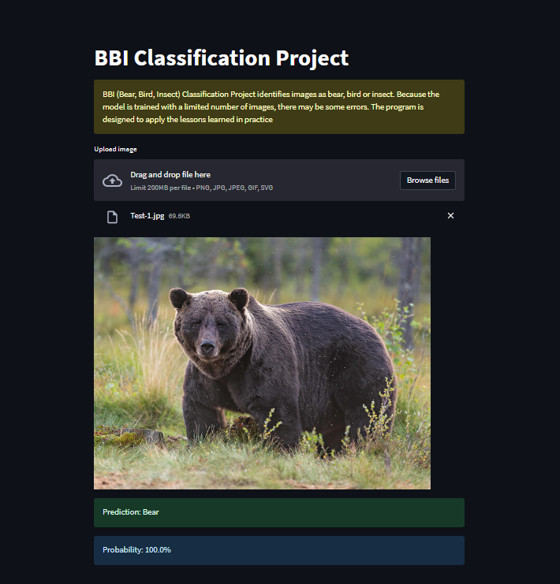

# BBI Project

This project focuses on classifying images into three categories: bear, bird, or insect. It utilizes a pre-trained deep learning model to make predictions based on the uploaded images. The application is built using Streamlit, a Python library for creating interactive web applications.

## Table of Contents

- [Prerequisites]()
- [Getting Started]()
- [Model Training]()
- [Contributing]()
- [Program View]()
- [Acknowledgments]()
- [Resources]()
- [License]()
- [Contact]()

## Prerequisites

To run this project locally, you need to have the following dependencies installed:

- Python 3.6 or higher
- Streamlit
- Fastai
- PIL (Python Imaging Library)

You can install these dependencies by running the following command:

```
pip install streamlit fastai pillow
```

## Getting Started

To run the BBI Project, follow these steps:

1. Clone the repository:

```
git clone https://github.com/shamsiddinabbasov/project/bbi-project.git
```

2. Navigate to the project directory:

```
cd bbi-project
```

3. Set up the virtual environment (optional but recommended):

```
python -m venv venv
source venv/bin/activate  # For Mac/Linux
venv\Scripts\activate.bat  # For Windows
```

4. Install the project dependencies:

```
pip install -r requirements.txt
```

5. Run the Streamlit application:

```
streamlit run app.py
```

6. Access the application in your web browser at `http://localhost:8501`.

## Model Training

The BBI Classification model is trained using the fastai library. If you want to train the model with your own dataset, follow these steps:

1. Prepare your dataset with the following structure:

```
dataset/
├── bear/
│   ├── bear_image1.jpg
│   ├── bear_image2.jpg
│   └── ...
├── bird/
│   ├── bird_image1.jpg
│   ├── bird_image2.jpg
│   └── ...
└── insect/
    ├── insect_image1.jpg
    ├── insect_image2.jpg
    └── ...
```

2. Update the model training code in the `BBI Project.ipynb` file to suit your dataset and requirements.
3. The trained model will be saved as `bbi_model.pkl` in the project directory.

## Contributing

Contributions to this project are welcome! If you find any issues or have suggestions for improvements, please open an issue or submit a pull request.

## Program View

<p align="center">
    
</p>

## Acknowledgments

- The BBI Project is based on the fastai library and the Streamlit framework.
- Special thanks to the developers and contributors of these open-source libraries.

## Resources

Dataset used for this project is at &copy;[Open Images Dataset v4](https://github.com/EscVM/OIDv4_ToolKit)

## License

This project is licensed under the [MIT License](https://opensource.org/licenses/MIT).

## Contact

If you have any questions or inquiries, please contact mrshamsiddinabbasov@gmail.com.


